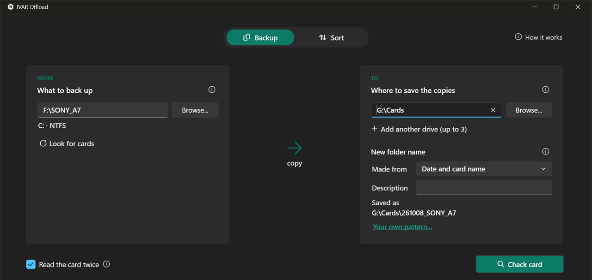

# IVAR Offload

IVAR Offload backs up your memory cards safely. It also sorts the videos from the photos. It runs on Windows 10 and 11.

- **Backup** copies a card to one, two or three backup drives and checks every copy. It tells you that a card has a
  complete backup only when this is true.
- **Sort** moves the videos (or the photos) from a folder of card backups into a target folder. The files keep their
  sub-folders.

The app never overwrites anything. It deletes a file only after it checks the copy of that file. If a job stops before
the end (for example, because of a loose cable, a crash or a power failure), **Resume** continues the job from the last
completed step.



## Download

Download the latest zip file from [Releases](https://github.com/ivarstudios/ivar-offload/releases):

- `…-win-x64.zip` for most PCs
- `…-win-arm64.zip` for Windows on Arm (Snapdragon laptops and Arm Surfaces)

Extract the zip file. Then run **IVAR Offload.exe**. You do not need to install the app, so it also runs from a USB
stick. The first start of a new version takes a few seconds longer.

This is a beta version, and it does not have a digital signature yet. Because of this, Windows can show *Windows
protected your PC*. If this occurs, click **More info → Run anyway**. Or, before you extract the zip file, right-click
it. Then select **Properties → Unblock**. When Smart App Control is on, Windows blocks the app at this time.

## Back up a card

1. Insert the card. In the **Backup** tab, under **What to back up**, click the card, or choose any folder (for example,
   a camera SSD). The app only reads the card. It never changes it.
2. Under **Where to save the copies**, choose one, two or three backup drives. Use a different drive for each copy: two
   copies on one drive are not two backups.
3. The **New folder name** is today's date and the card name, for example `260930_MAVIC`. For a different order, choose
   an item under **Made from**. If you want, add a **Description**: `260930_MAVIC_KebnekaiseFlight`.
4. Click **Check card**. The app copies nothing yet. It shows what is on the card, how long the backup will take, and
   other important information.
5. Click **Back up 412 files to 2 drives**.

When the backup is complete:

- **Green** means that every file is on every backup drive, and that each copy is on a different drive. The app read
  every copy again from its drive and checked it.
- **Amber** means that the card does not have a safe backup yet. For example, a file is missing, or two copies are on
  one drive. The result gives the reason.

Do not format a card before you get a green result. **Sort this backup...** on the result opens the backup in the Sort
tab.

**Did you record more on the same card?** Back it up again to the same backup drives. The app identifies the card and
offers to add only the new files to the earlier backup. Then it checks the whole card again.

## Sort the videos from the photos

Sort moves one type of file out of a folder of card backups. The folder structure stays the same:

```
E:\Footage\260930_MAVIC\DCIM\100MEDIA\DJI_0003.MOV
  -> E:\Footage-Video\260930_MAVIC\DCIM\100MEDIA\DJI_0003.MOV
```

1. In the **Sort** tab, choose the **Source folder**: the folder that holds your card backups.
2. Under **What to move**, choose **Videos** or **Photos**.
3. The app enters a **Target folder** for you (`…-Video` or `…-Photos` next to the source folder). If you want a
   different folder, change it.
4. Click **Check folder**. Nothing moves yet. The app shows what will move, what stays, and why.
5. Click **Move 412 videos**.

Sidecars, proxies, drone telemetry and sound recordings move with the files that they belong to. Camera card folders
move as a whole. Sort a backup, not the card itself. If you select a memory card as the source folder, the app asks you
to back up the card first.

Before you delete anything from the source folder, open **More**. Then click **Check the moved files again**. **More**
also offers to remove the folders that the sort left empty. The app asks you before it removes them.

**Undo** returns every file to its source folder. Click **Undo this sort** on the result, or **Undo a sort...** at the
top of the window. You can also undo a sort days later, or on a different PC.

## If there is a problem

- **A drive is disconnected, a cable is loose or a drive is full:** the app tells you what happened. A backup continues
  on your other backup drives. Fix the problem. Then click **Resume**. Nothing is lost.
- **You closed the app, the app crashed or the power failed:** the next time that you start the app, a banner offers
  **Resume**.
- **You must stop:** **Stop** finishes the file in progress or rolls it back. Then it is safe to disconnect the drives.
  **Pause** is not sufficient: while the job is paused, keep the card and the drives connected. Later, click
  **Resume**, or click **Stop here...** to end the job and keep what it completed.
- **The folder is synchronized** (OneDrive, Dropbox, Google Drive, iCloud, Resilio, Syncthing, Synology Drive and other
  sync tools): the sync tool sees each file that moves out of the folder as a deletion. As a result, the files also
  disappear from your other devices. A pause of the sync tool does not prevent this. If you want the files on your
  other devices, synchronize the target folder too. The preview warns you.

The **How it works** button (top right) and the small (i) buttons explain each step in the app.

## Report a problem

Open an [issue][issues]. Tell us the version (lower right of the window), what you did and what the result said. The
`.summary.txt` file of the job, from its `_IVAROffload` folder, helps most. This file lists your file and folder names.
Remove all private information before you post it. Never attach footage.

---

## Under the hood

This part is for DITs, data wranglers and all people who want to know exactly what occurs. The app does everything
below automatically. You do not need to configure anything.

- [Backup](#backup): how the app copies and checks, when the result is green, ASC MHL, logs, folder names, additions to
  a backup
- [Sort](#sort): how a file moves, results, memory cards, what counts as video or photo, logs, undo
- [Command line](#command-line)
- [Known limits](#known-limits)
- [Development](#development): how to build, test and publish, and what is next

### Backup

**What the app copies.** The app copies every file on the card. This includes hidden and system files, camera XML,
`.BIN` and `.MHL` files, and empty folders. The copies keep all three timestamps, the attributes and the folder dates.
The only items that the app does not copy are `System Volume Information`, `$RECYCLE.BIN`, `.Trashes`,
`.Spotlight-V100` and `.fseventsd`. The app never follows links, and it never reads cloud placeholders that are not
downloaded. It lists both, and both prevent a complete backup.

The app also copies and checks named data streams, except `Zone.Identifier`. Only NTFS folders have these streams, not
cards. If the file system of a backup drive cannot store them (for example, exFAT), a file with named data streams
fails on that drive.

**How the app checks every file.**

- The app reads the card one time. It writes each chunk to all backup drives at the same time. In the same pass, it
  calculates the hashes of the chunk (SHA-256 and xxHash64).
- The app writes each copy to a temporary name and flushes it. Then it **reads the copy again from its own drive,
  without the Windows cache**. At the same time, it reads the card file a second time (**Read the card twice**, which
  is on by default). If you clear this option, the backup is faster, but the app still reads every copy again. The app
  renames a copy into place only if its SHA-256 matches the SHA-256 of the card file. It never renames a copy over a
  file that already exists.
- If a copy does not match, the app makes it one more time. If a backup drive damages the same copy two times, the
  backup stops on that drive.
- The app opens the card as read-only and never writes to it. It does not even change the last-access times. The backup
  also works when the write-protect switch is on.

**A problem on one drive never stops the other drives.** If a backup drive is full or disconnected, or if it damages
files, the backup stops on that drive, and the app shows the reason. The other drives finish, and **Resume** completes
the backup on that drive later. If you remove the card, or if the card does not respond, the whole backup stops. The
app records no file as skipped, and **Resume** continues the backup.

If the app cannot read a file on the card, or if the file changes or reads differently the second time, only that file
fails. The backup continues with the other files, and Resume reads the failed file again. After two files read
differently, the backup stops. Check the card, the card reader, the cable and the port.

**When the result is green.** The result is green only if every file of the card has a checked copy on every backup
drive. Each backup folder must also be on a drive (volume) of its own. And each backup folder must have its ASC MHL
files, or the result must say why the ASC MHL history on the card prevented them. Also:

- After the backup, the app scans the card again. If someone added or changed files on the card after the preview, the
  result stays amber.
- All copies of a file must be identical. If a later copy (after Resume) is different from a checked copy on a
  different backup drive, the app does not accept it.
- If the backup finished on a backup drive in an earlier run, the app examines that backup folder again. If a sort
  moved a file out of it, or someone deleted a file after that run, that backup folder is not complete.
- The app checks copies that share a drive, and copies on the drive that you back up. But the result is never green for
  them (*Copied, but not to separate drives*). The preview shows this next to the start button.
- All other results are amber. They show a line for each drive (*F:\Cards\260928_SONY_A: 100 of 412 checked. The backup
  drive F: is full.*) and a red line that tells you not to format the card. The app never says that you can format a
  card.

**Details** on the result shows how the app compared the copies. It also shows if the app wrote the ASC MHL files on
each drive. Under **More**, **Check the copies again** reads every copy on every drive again. It counts the files that
**Sort this backup...** moved out as moved, not as damaged.

**The app copies nothing and does not start the backup in these cases:** a backup folder already exists and is not
empty, or it is on or inside the card. (A backup never mixes two cards. If the folder holds an unfinished backup of
the same card, the app offers to resume it.) You chose the same folder two times, or more than three backup drives. A
drive is read-only, or it has too little free space (if copies share a drive, each copy needs its own space). The card
has files of 4 GB or more, and a backup drive uses FAT32.

**ASC MHL.** The app writes an `ascmhl` folder into each backup folder. This folder contains a generation manifest
(xxHash64 of every file, plus directory content and structure hashes) and `ascmhl_chain.xml`. So Hedge, Silverstack or
`ascmhl-debug verify` (also `-dh`) can check the backup independently.

A card can already have ASC MHL histories from an earlier offload (in its top folder or in subfolders). The app copies
these histories as they are, and it adds the next generation (in xxHash64) to each history. This generation records a
file as *verified* if the history had an xxHash64 for it, and as *original* if not. The top-level history refers to the
nested histories.

The app does this only if every history is complete and not changed (every manifest that its chain lists is there, with
no changes). Each history must also use only the standard ignore patterns. And the card must still match each history,
in the hash format that the history used (xxh64, xxh128, xxh3, md5, sha1, c4). If not, the app writes no manifest in
that backup folder, and the result gives the reason. If a card no longer matches its own earlier checksums, the result
is never green.

Because of an ignore pattern, the manifests do not include the `_IVAROffload` log folders. But if the card has its own
`_IVAROffload` folder from an earlier sort, the app still copies and checks it.

**Logs.** Each backup folder has its own log, `<backup folder>\_IVAROffload\<job>.backup.jsonl`, with a `.summary.txt`
and a `.manifest.csv` (every file, its SHA-256 and xxHash64, and its status). All backup folders of a job have the same
job id, so you can resume the backup from any of them. The app writes nothing to the card. A sort never includes the log
of a backup.

**Unfinished backups** (because you closed the app, the app crashed, the power failed or a backup drive disconnected)
show in a banner at the next start. **Resume** needs the card. **Stop here...** keeps the checked copies, records the
other files as not copied, and deletes nothing. If a backup folder has a checked copy of every file, the app finishes
that backup folder correctly, with the ASC MHL files.

If the unfinished copy is on a drive that is not connected, the banner names the drive. Instead of **Resume**, it then
offers **Check again** (after you connect the drive) or **Forget this backup**. On a different PC, **Check card** with
that backup drive finds the unfinished backup of the card there, and the banner offers it. If a card or a backup drive
returns with a different drive letter (card readers often change letters), the app finds it by the serial number of the
drive.

If the log on a backup drive is damaged, the backup does not continue on that drive. The other drives continue. You can
start a new backup of a different card while a backup is unfinished.

When a backup starts, the app remembers its backup drives. If one of these drives is not connected the next time, the
preview names it. The app never silently makes one copy fewer.

**Folder names.** The default name is `{YYMMDD}_{card}` (the day of the backup). `{card}` is the name of the card in
Windows, or the name of the folder if you chose a folder. **Made from** offers four ready-made names, each with an
example. The app adds the **Description** to the end. While you type, **Saved as** shows the full folder on every backup
drive. If a folder with that name already exists (for example, for the second card on the same day from a camera that
gives all cards the same label), the app adds `_2`, `_3` and so on.

With **Your own pattern...**, you can combine `{card}`, `{camera}` and date and time codes in braces: `YYYY` or `YY`,
`MM`, `DD`, `HH`, `MM` (minutes, right after `HH` or right before `SS`) and `SS`. You can put `-`, `_`, `.` or a space
between them, for example `{YYYY-MM-DD}_{card}` or `Wedding {YYMMDD} {card}`. The app keeps text outside braces as it
is. If the card does not show the camera, the name does not include the camera and its `_`. Patterns from earlier
versions (`{date}`, `{year}`, `{month}`, `{day}`) still give the same names. **Reset** returns to `{YYMMDD}_{card}`.

The app identifies the camera make from the folders on the card: Sony `M4ROOT` or `100MSDCF`, Canon `100CANON`, a RED
`.RDM`, an ARRI reel, Blackmagic `.braw`, and others.

**Add files to an earlier backup.** In each folder that you chose on the backup drives (for example, all backups in
`E:\Cards`), the preview finds the newest finished backup of the same card. A backup is of the same card if it has the
same drive serial number and folder. Also, at least half of the files that it checked must still be on the card, with
the same name, size and date. Deleted shots, new shots and the index files that cameras write again with every shot
(Sony `MEDIAPRO.XML`, AVCHD `INDEX.BDM`, Canon catalogs and others) do not change this. But if you format the card, this
changes.

If every backup drive has that same backup, the preview says so (*There is a backup of this card from 2026-09-28 14:02
in E:\Cards\260928_SONY_A. The card now has 38 new files (12.4 GB) ...*) and offers:

- **Add the new files to that backup** (the default). The app copies only the files that are not in the folder exactly
  as they are on the card now. These are new files, files that changed on the card, and files that are no longer in the
  folder (because **Sort this backup...** moved them out, or someone deleted them). After this, the folder is a mirror
  of the card again. Then the app reads every file of the card again, from the card and from each copy. It compares
  them with the SHA-256 that the earlier backup recorded. The result means the same as a full backup: *The app copied
  38 new files and checked all 450 files. It did not change the card.*
- **Make a new full backup** into a new folder.

The app does not overwrite or delete anything in the backup folder. If a file there is different from the card file,
the app replaces it only after it makes and checks a new copy:

- If a file changed on the card (usually a shot whose number the camera used again after a deletion), the earlier
  version stays next to the new one as `IMG_0450 (earlier).JPG`. The app renames a sidecar with the same name in the
  same way. The app reads the earlier version when it renames it. The ASC MHL manifest lists it, and later top-ups keep
  it. The preview warns you about these files first.
- The app moves all other files into `_IVAROffload\replaced\<job>\`, with their sub-folders (for example, an older
  camera index file, or a copy that someone edited or that became damaged on the drive). The preview warns about edited
  copies. The app finds a damaged copy only when the top-up reads it, and the result names the drive.
- If the app cannot make a copy (because the file is no longer on the card, you removed the card or you ended the
  backup), the old file stays where it is.
- The app never moves files that are no longer on the card. It reads them again. If someone edited such a file in the
  backup folder after the earlier backup (it has a different size or date), the app reports it and keeps it as it is.
  If such a file has the same size and date but no longer matches its checksum, it is damaged. The result is then
  amber, but without the line that tells you not to format the card, because the card cannot replace the file.

If the card gives different data for a file than the backup checked (with the same size and date), the app reads the
file one more time. If the second read gives the same data, the file changed on the card, and the app copies it again.
If not, the card reader is not reliable. The app keeps the copy, and the file fails. Resume reads the file again.

A top-up writes a new log next to the earlier log, and the app never changes the earlier log. So you can resume a
top-up like any backup. The app adds a new generation to the ASC MHL history. If files that the history lists changed or
are missing, the app moves the history into `_IVAROffload\replaced` and starts a new history. (An ASC MHL history cannot
record these changes.) As a result, `ascmhl verify` passes.

The preview does not offer a top-up (and gives the reason) if one of these conditions is true. A backup drive has no
earlier backup of the card, or the backup drives have different earlier backups. The ASC MHL history on the card changed
or is new after the earlier backup (another offload tool wrote it). There is an unfinished backup of the card.
Otherwise, the preview names the earlier backups of the card whose files are all still on the card, with no changes.
None of this prevents a new full backup.

### Sort

**How a file moves.**

| Where | What happens |
|---|---|
| Same drive (for example, `E:` to `E:`) | The app **renames** the file into place. It never reads the data again after the move, and it never writes the data again. Before the rename, the app records the SHA-256 (if **Record checksums** is on) and the NTFS file id. After the rename, the file at the target location must be the *same file record*, with the same size and timestamps. |
| Between drives | The app copies the file to a temporary `.offload-partial` file, calculates its SHA-256 during the copy, and flushes the copy. Then the app **reads the copy again, without the Windows cache**, and **reads the original a second time**. Both must match before the app renames the copy into place and deletes the original. The app also copies and checks named data streams. |
| Deletion of an original | The app deletes an original only after a checked copy is in place. It uses a handle that first checks again that the original did not change (size, dates, file id), and that no other program writes to it. |

**When there is a problem.**

| Situation | What happens |
|---|---|
| A file with the same name is already in the target folder | The app never overwrites it. An identical copy (same name, size and date) counts as done. If the file is **different** (probably from another card that started its file numbers again), that file **and the files that belong with it** stay in the source folder. Sort each card into its own folder. |
| A file changed after the preview | The app does not move it. The job does exactly what the preview showed. |
| A file is in use (sync tool, antivirus, player) | The app tries again for a few seconds. Then it reports the file. **Resume** tries again. |
| A file in the source folder reads differently the second time | The app keeps the original and reports it. Check the drive, the cable, the port and the card reader. After two such files, the job stops. Do not format that drive, and do not delete that source folder. |
| The target drive damages a copy | The app keeps the copy as `<name>.damaged-copy` and copies the file again. If that copy is also damaged, the job stops. |
| A drive is disconnected or does not respond, or someone renames a folder | The job **stops**. The app records no file as skipped. The message tells you if the drive or only the folder is missing. If a drive returns with a different letter, the app identifies it by its serial number. The message then tells you which letter to give the drive again. |
| The target drive is full | The app checks the free space before each copy. The job stops. You can resume it when there is sufficient space. |
| The app cannot remove the originals (read-only, no permission) | After two such files, the job stops, and the checked copies stay in place. Fix the permission. Then resume the job, or end it. |
| An original disappears during a job (something else removes it) | The app never deletes a file that can be the last copy. This is also true after a crash, after Resume and when you end the job. The app puts a checked copy into place (or keeps it as `<name>.verified-copy` if a different file has its name). It keeps a copy that it did not check as `<name>.unverified-copy`, and a damaged copy as `<name>.damaged-copy`. The app reports the file as *missing from the source folder*, with the copy that it kept. |
| You end a job when the app cannot reach its source folder | The app deletes nothing, and it makes no decision about any original. It puts checked copies into place as *copied, original not checked*. It keeps the other copies with the names above and reports them as not moved, never as missing. When the folder is available again, you can undo the moved files. |
| Crash, power failure, killed process | The app writes every step to the job log and flushes it *before* the next step. When you resume, the app compares each unfinished file with what is actually on the disk, not only with the log. |
| The same job is open two times | The app locks a job that runs, checks files or undoes a sort. Another window or the command line then says that the job is open in a different place. |

**Timestamps and attributes.** The app keeps the created, modified *and* last-accessed times. To calculate checksums,
it reads files through a handle that tells NTFS not to update the last-access time. The app also keeps the attributes
(read-only, hidden, archive). This is also true for a move on the same drive and for its undo. Each folder in the target
folder has the same dates as its folder in the source folder.

**Speed** (NVMe): a move on the same drive with checksums runs at approximately 1.4 GB/s. That is approximately 4–5
minutes for 360 GB of video. Without checksums, it takes only seconds. Between drives, the app writes each file one
time, reads the copy one time and reads the original two times. So expect a little less than the speed of the slower
drive.

**Results.** When a sort finishes or you end it, the app scans the source folder again in the background. It combines
this scan with the record of the job. The command line does the same, and its exit code and the summary of the job use
this result.

- The result is **green** only when the job ended and no file failed. Also, all planned files must be out of the source
  folder, and the new scan must find nothing else that needs to move. If the scan could not run or could not read some
  folders, the result stays amber.
- In all other cases, the result is **amber**. It always has a line about what is left, for example: *Left in the
  source folder: 17 videos (38 GB), 2 unrecognized files. Check these files before you delete or format anything.* It
  also has a line for each reason. Examples of reasons are a different file with the same name in the target folder, a
  change after the preview, and a file in use. Other examples are an original that the app could not remove, and a job
  that ended early.
- Files that the preview kept in the source folder (**held back** in the list) count as left in the source folder. This
  is also true when the app cannot scan the source folder again.
- The app never reads **online-only** files (cloud placeholders that are not downloaded). So they stay in the source
  folder, and the result stays amber. The result tells you how to fix this. A short online-only clip next to a photo
  with the same name can be a Live Photo or a video. So the app lists it under *Needs a look*.
- The result mentions links with a video name (the app never follows links) and media in an editing or processing
  project (these files stay on purpose). But they do not make the result amber.
- Files that **disappeared from the source folder** are a separate group: *missing from the source folder (something
  else removed the file)*. The app never counts them as still in the source folder.
- **Show files still in the source folder** lists the files that are left. If some of them can move now (because they
  are new after the preview, or an earlier sort of the same folder left them), the button at the bottom offers **Move
  the remaining 17 videos**.
- A CinemaDNG or other image-sequence clip, or a RED clip in several parts, counts as one video. Companion files and
  macOS `._` files never count.

**Check the moved files again** reads every moved file again and compares its checksum. It also lists every planned file
that did not move, every file that the preview kept, and every missing file. A green result is only about the files
that moved. The files that stayed are still only in the source folder.

**Memory cards and camera drives.** Sort is for card backups. If the source folder looks like a card, the move button
first asks you to choose: **Back up this card first** (the default, which opens the Backup tab with the card) or **Sort
anyway**. Some cameras (for example, the Blackmagic Pyxis) record directly to an SSD, so you can sort such an SSD on
purpose. After a sort of a card, the result is never green. A red line says that the card still holds the only copy of
the files that stayed, and this line stays after you check again. When **More** offers to remove the folders that a
sort left empty, it never offers the camera folders of the card (`DCIM\100MSDCF`, `PRIVATE\M4ROOT` and others).

A source folder counts as a card if the root of its drive shows a camera structure (`DCIM` with a camera folder,
`PRIVATE\M4ROOT`, `AVCHD`, a P2 or Canon XF `CONTENTS`, `BPAV`, `XDROOT`, a RED `.RDM` folder, an ARRI reel folder, or
clips in the root as Blackmagic cameras write them). Also, the drive must be removable, or the source folder must be the
root of the drive or inside one of those card folders. Cameras write FAT32, exFAT or UDF, so the app never identifies an
NTFS or ReFS drive as a card. If files cannot move out of a source folder (write-protected, read-only, no permission),
the app does not accept it.

**Other checks before a sort.**

- The app does not accept system folders: the root of the system drive, Windows, Program Files, AppData and the user
  folder itself. For other drive roots, and for Pictures, Videos, Desktop, Documents and Downloads, the app shows a
  warning.
- The app does not accept a folder inside a video card structure (for example, `...\PRIVATE\M4ROOT\CLIP`). It offers
  **Use this folder** for the folder that holds the whole card. If someone copied a Sony card without its
  `PRIVATE\M4ROOT` wrapper, that copy is a whole card.
- The app does not accept a folder inside an application library (Apple Photos, Final Cut Pro, Lightroom, Capture One,
  Luminar and others). If you move files out of it, the library will not work correctly. For a folder inside an
  editing or processing project, the app shows a warning.
- **The target folder can be inside the source folder** (`E:\` → `E:\Video` on a camera SSD). The scan does not include
  the target folder. The target folder cannot be the source folder itself, and the source folder cannot be inside the
  target folder. The app decides this from the real location of the paths. So a junction, a `subst` or mapped drive
  letter, or a short name cannot hide it. If a `subst` letter changes to a different folder later, the job stops and
  does not work in that folder.
- A FAT32 target folder cannot hold files of 4 GB or more. The app does not accept a read-only target folder. The check
  of the free space includes some extra space for each file.
- If the target folder already holds files that a sort moved from a different folder, or in the other mode, the preview
  shows a warning. The line above the button also becomes amber. If you sort the same source folder into it again, the
  app continues the earlier sort.

#### What counts as video, photo or neither

- **Video**: `.mov .mp4 .m4v .avi .mts .m2ts .mxf .mkv .braw .r3d .crm .ari .insv .360 .nev` (Nikon N-RAW) `.osv`
  (DJI Osmo 360) `.zraw` (Z CAM) `.ts .trp .mlv .mcraw .cine .arx ...`, and the proxies `.lrf` (DJI) and `.lrv` (GoPro,
  Skydio).
- **Photo**: `.jpg .jpeg .heic .hif .png .tif .psd .dng .nef .raf .arw .arq .cr2 .cr3 .orf .rw2 .gpr .insp .mpo .jps ...`
- **Sound** (`.wav .bwf .rf64 .w64 .mp3 .m4a .aac .aif .aiff .flac`): a recording with the name of a photo or video
  moves with it (camera voice memos). A recording with no photo or video of the same name is recorder or dual-system
  sound, and it **moves with the videos**. A recording that matches both stays, and the app lists it. The take file of a
  field recorder (Zoom `.hprj`, `.ZDT`) moves with the recordings in its folder.
- **Companion files move with their file.** The app finds them by name in the same folder: `.xmp`, `.aae`, Sony
  `C0001M01.XML`, macOS `._name`, raw editor settings (Capture One, NX Studio `.nksc`, Canon DPP, DxO, ON1,
  RawTherapee, Resolve `.drx`), and GIS world files and the `.prj`, `.ovr` and `.aux` files of rasters. For double names
  (`clip.MOV.xmp`, Kyno `.LP_Store\clip.MOV.lpmd`, NX Studio `NKSC_PARAM\X.NEF.nksc`), the inner extension decides. If
  a photo and a video have the same name, an `.aae` moves with the photo. An `.xmp` also moves with the photo if the
  photo is a raw file and the videos are `.mov`/`.mp4`/`.m4v`. In other cases, the `.xmp` stays, and the app lists it.
- **Always video**, even without a name match:
  - `.thm` thumbnails, DJI `.scr` screennails (also in `MISC\THM\100\`), `.srt` drone telemetry, Blackmagic RAW
    `.sidecar` and RED `.rmd` files.
  - An `.xml` file with the name of the clip folder that it is in, if that folder holds videos and no photos (ARRIRAW).
  - An unrecognized file with the same name as a video next to it (the app lists it under *Needs a look*).
  - Everything inside a **video card structure**, which moves as a whole: Sony `PRIVATE\M4ROOT`, `AVCHD`/`BDMV`, XDCAM
    `XDROOT` and `BPAV`, Panasonic `PANA_GRP` and P2 `CONTENTS`, Canon XF `CONTENTS`, RED `.RDM`/`.RDC`.
  - **CinemaDNG and image-sequence clips**: a folder of numbered frames (`.dng .dpx .exr`) is one clip, and everything
    in it moves with the videos. The folder needs at least 10 gap-free frames with the name of the folder or of a sound
    file next to them (`A001_C003\A001_C003_000001.dng`). DNG frames also need CinemaDNG tags. DNG frames with these
    tags are a clip even with gaps, fewer than 10 frames or a renamed folder. But fewer frames must be missing than are
    present. A mapping run of a drone (`100MEDIA\DJI_0001.DNG` and others) stays with the photos.
- **iPhone Live Photos**: a `.MOV`/`.MP4` next to a `.HEIC` (or an `IMG_` `.JPG`) with the same name can stay with the
  photo. It stays if it has the Apple Live Photo identifier and is not larger than 15 MB (approximately 3 seconds). A
  clip without the identifier moves with the videos, and the app lists it under *Needs a look*.
- **DJI hyperlapse frames** (a `HYPERLAPSE_nnnn` folder, or at least two such photos in a folder) stay photos, but the
  app keeps them together. If one frame has a name conflict, the whole hyperlapse stays in the source folder.
- **Mapping missions stay whole**: a folder can have photos and a DJI timestamp file (`.MRK`, not `AUTPRINT.MRK`) or DJI
  LiDAR data (`.LDR` with `.IMU`, `.RTK`, ...). Then the timestamp, LiDAR and RINEX/PPK files go where the photos go.
  Base-station data (`.obs .nav .rnx .24O ...`, `.ubx .sbf .T02 ...`) and lists of ground control points outside a
  mission folder stay. In photo mode, the preview names them.
- **Stays in both modes**:
  - Card and app files (`.mhl .dsc .dat .bin .db .gis .pbuf .txt .json .csv ...`), Final Cut Pro XML exports
    (`.fcpxml`, which recorders such as Atomos write next to their clips), point clouds, meshes and map layers (`.las
    .laz .obj .mtl .kmz .kml .shp .shx .dbf .geojson`).
  - Everything in an **editing or processing project** folder: a folder that holds a `.prproj .drp .aep .veg .psx .p4d
    .p4m .rcproj ...` file, an OpenDroneMap/WebODM project, or a DJI Terra project. The preview names them.
  - Unrecognized file types. The app lists them, and it shows a separate warning for large files.
- **Never entered**: application libraries (`.photoslibrary .fcpbundle .imovielibrary .lrdata .lrlibrary .cocatalog
  ...`, the Photo Booth library, a Luminar catalog's folder), sync folders (`.sync`, `.stfolder`, `@eaDir`, `.@__thumb`),
  `ascmhl`, `$RECYCLE.BIN`, `System Volume Information`, and the app's own log folders (`_IVAROffload`, and
  `_IVARIngest` and `_IngestSorter` from its earlier names). The app does not follow links and junctions.
- The preview warns about photo catalogs in the source folder (`.lrcat`, Capture One, Luminar). After the move, you must
  link their imported files again. The preview also warns about ASC MHL manifests, because they will report the moved
  files as missing.

#### Logs, receipt and undo

Each sort writes these files into **the target folder**, `<target>\_IVAROffload\`:

- `<job>.journal.jsonl`: the job log, step by step (append-only JSON Lines). It contains the plan, with the size and
  dates of every file, and every step with its time, SHA-256 and file ids. Resume and undo use it.
- `<job>.manifest.csv`: one row for each file, with status, source, destination, size, SHA-256, method and time. You can
  open it in Excel.
- `<job>.summary.txt`: what happened, in plain words. It has a section for each type of file that did not move, with
  the reason.

After files leave the source folder, the sort also writes a receipt into **the source folder**,
`<source>\_IVAROffload\`:

- `<job>.moved-out.csv`: every file that left, where it went, and its SHA-256. So you can find every file without the
  app.
- `<job>.moved-out.txt`: what left, when it left and where it went, what stayed, how to undo the sort, and where the job
  log is.

The app writes these files while the job runs (at the start, after the first file, approximately every 15 seconds and
at the end). It writes each one through a temporary file, so a crash never leaves an incomplete list. After a crash,
the app updates them from the job log. The app writes nothing into the source folder before a file leaves it. You can
check the checksum of any file independently with `Get-FileHash -Algorithm SHA256 <file>`.

**Undo** lists the sorts that this PC remembers. It can also list the sorts of a folder that you choose, or the sort of
a log or receipt that you open. First, it shows what will happen (*Return 412 videos (360 GB) to E:\Smith\Card1? 3
files changed after the sort and will stay where they are.*). Then it runs like any job, with the same progress
display, crash safety and honest result.

- Files return only to the folder that they came from, and that folder must prove its identity. It must hold the
  receipt, or still match the record of the sort. The app does not accept a new folder that only has the old name. It
  follows folders that someone renamed or moved. If the app cannot confirm the folder, use **Choose the folder that the
  files came from...** to select it. The app then checks the folder and shows a new preview.
- A file that changed after the sort stays where it is. If a different file is now in the original location of a file,
  the app never overwrites it. The other files of a clip return, also when one of its files cannot return.
- Between drives, the app copies each file to its source folder. The copy must match the recorded checksum before the
  app removes the file from the target folder.
- Undo uses only the logs, so it continues to work after a restart and on a different PC. You can undo a sort one time.
  If an undo could not finish, the sort is *partly undone*, and you can undo the other files later.

**Unfinished sorts.** The banner offers **Resume** or **Stop here...**. **Stop here...** finishes the file in progress
or rolls it back, keeps all other files where they are, and ends the job. If the drive with the job log is not
connected, the banner tells you. After you connect the drive, click **Check again**, or click **Forget this job** (its
log stays on the drive).

If someone renamed or moved the target folder of a job on its drive, the app finds it again automatically. It searches
nearby folders, other sorts on that drive and the root of the drive, for approximately 2 seconds. It never identifies a
copy of the folder as the target folder.

**Jobs from earlier versions.** The earlier names of the app were Ingest Sorter and then IVAR Ingest. The app can resume,
check and undo the sorts that these versions recorded in `_IngestSorter` and `_IVARIngest` folders, like any other sort.
These sorts keep their log folder. For a backup that IVAR Ingest made, the app can resume it, check it again and add
files to it in its `_IVARIngest` folder. It also continues its ASC MHL history. Until the app saves its own settings in
`%LOCALAPPDATA%\IVAROffload`, it reads the settings that IVAR Ingest or Ingest Sorter left in
`%LOCALAPPDATA%\IVARIngest` or `%LOCALAPPDATA%\IngestSorter`.

### Command line

`ivar-offload.exe` is in the same zip. It uses the same engine as the app, for scripts:

```
ivar-offload preview --source E:\Footage --target E:\Footage-Video [--mode videos|photos] [--no-checksums] [--list]
ivar-offload run     --source ... --target ... [--mode ...] [--no-checksums] --yes
ivar-offload resume  --target E:\Footage-Video                  (or --journal <job log>, for all of these)
ivar-offload close   --target ...      Finishes or rolls back the files in progress, then ends the job.
                                       The other files stay in the source folder.
ivar-offload verify  --target ...      Reads every moved file again and compares the checksums.
                                       It also lists the files that did not move.
ivar-offload status  --target ...      Shows the summary of the job.
ivar-offload jobs    --target <folder> Lists the jobs of a folder (jobs that moved files into it or out of it).
ivar-offload undo    --target <folder> [--job <id>] [--to <folder>] [--yes] [--list]
ivar-offload undo    --journal <job log, manifest, summary or .moved-out receipt> [--to <folder>] [--yes] [--list]

ivar-offload backup  --source F:\ --target E:\Cards [--target N:\Cards ...] [--name <folder name> | --name-template "{YYMMDD}_{camera}_{card}"] [--no-source-reread] [--top-up] [--list] [--yes]
ivar-offload backup-resume  --target E:\Cards\260928_SONY_A    (or --journal <backup log>, for all of these)
ivar-offload backup-close   --target ...   Finishes or removes the copies in progress, then ends the backup.
                                           IVAR Offload does not copy the other files.
ivar-offload backup-verify  --target ...   Reads every copy on every backup drive again and compares the checksums.
ivar-offload backup-status  --target ...   Shows the summary of the backup on that backup drive.
```

Without `--yes`, `backup` and `undo` only show the preview, and `run` stops with a usage error. To see the preview
first, use `preview`. `--list` names the files. For a sort, these are the files that move. For `backup`, these are the
files to copy (with the action for each file on a top-up). For `undo`, these are the files that are already back and
the files that cannot return.

`jobs` also shows the undos of each sort. `--top-up` adds the new files of the card to its earlier backup and checks the
whole card. Unlike the app, `backup` never adds `_2`. It does not accept a backup folder that exists and is not empty,
so give a second card with the same label a `--name`. If you run `run` again after you ended a job in the middle of a
clip, it moves the rest of the clip. The command line does not ask the memory-card question, but a sort of a card never
gives exit code 0.

| Exit code | Sort | Backup |
|---|---|---|
| 0 | done or ended, and no file that needs to move is still in the source folder (`verify`: all files match) | every file checked on every backup drive (unlike green in the app, the command line does not check for separate drives) |
| 1 | finished or ended with failures (`verify`: the check found problems) | files failed, or the backup stopped on one of the backup drives (`backup-verify`: the check found problems) |
| 2 | stopped (on request or after a problem), or the app cannot use the job log (it is open in a different place, already finished or not readable) | stopped (on request or after a problem), or the app cannot use the log of the backup |
| 3 | usage error | usage error |
| 4 | the plan or the undo cannot run, the app cannot reach the log of the sort, or there is nothing to move | the backup cannot start (the preview gives the reason) |
| 5 | done or ended, but files that needed to move are still in the source folder or are missing. Code 5 can also mean that the app could not check the source folder again, or that the source folder is a memory card | done, but the backup does not contain everything that is on the card |

### Known limits

- Some of the open bugs in [Issues][issues] can give a green result that is not correct. A resumed backup does not
  check again the copies that it made before the interruption ([#5][i5]). **Check the copies again** can make an amber
  backup green ([#6][i6]). The app skips names that end with a space or a dot ([#8][i8]). It also skips a file that it
  reaches through a junction inside the target folder of a sort ([#9][i9]). On the command line, `backup` without
  `--yes` gives exit code 0, but it did not copy anything ([#14][i14]).
- At this time, the tests only simulate exFAT/FAT32 cards, USB card readers, changes of drive letters and drives that
  someone disconnects during a job ([#4][i4]). The same is true for the camera index files of a top-up ([#3][i3]).
- If someone moved the log folder of a sort too far for the search to find it (approximately 2 seconds and 5,000
  folders), the sort shows as *log not found*. Then open the log with **Open a log file...**.
- Only a new sort of the same source folder into the same target folder includes the files that an ended sort did not
  move.
- When the app reads a copy again, it does not use the Windows cache. But it cannot avoid the cache of the drive itself.
  A network share (NAS, SMB) or a RAID with a write cache can supply the data from its memory, not from its disks. If a
  file system does not accept unbuffered reads, the app reads the copies again with normal reads, which Windows can
  supply from its cache. NTFS, exFAT and FAT32 accept unbuffered reads.
- The app identifies drives by volume. So two partitions of one physical disk count as separate drives, and they can
  give a green result. Put each copy on a different disk.
- If a backup cannot read a named data stream of a card file, it reports the error for the backup drives, not for the
  card.
- If the ASC MHL history of a card has its own ignore patterns, the app does not continue it. The app checks the
  backup, but it writes no manifest (the result tells you this).
- A top-up needs the same earlier backup on every backup drive that you chose. On a new backup drive, the app makes a
  separate full backup. After a top-up that added files, `ascmhl verify -dh` reports the folders with new files. (The
  reference tool compares folder hashes with the first generation.) `ascmhl verify` passes.
- On NTFS/ReFS, the app checks each move by the file id. On exFAT/FAT, it checks each move by size and dates. If a copy
  between drives stops before the end, the app copies that file again from the start.

---

## Development

### Build and test

You need the .NET 10 SDK. For the ASC MHL tests, you also need the reference tool of the ASC:
`python -m pip install --user ascmhl`. To skip these tests, use `dotnet test --filter Category!=ascmhl`.

```
dotnet build -c Release
dotnet test -c Release                                                    # 582 unit tests, ~40 s
powershell -File tools\Test-EndToEnd.ps1 -OtherVolumeRoot <folder>         # 45 scenarios, ~10 minutes
powershell -File tools\Test-Gui.ps1 -OtherVolumeRoot <folder>              # 11 scenarios; opens windows on the desktop
```

`-OtherVolumeRoot` is a folder on a different drive than `%TEMP%`, for the scenarios that move files between drives. To
skip these scenarios, do not set it. `dotnet test` does not build the two programs. Run `dotnet build -c Release` before
the end-to-end tests and the GUI tests. Do not use the mouse or the keyboard while the GUI tests run.

- **Unit tests** cover the file-type rules for each camera family, the checks of the preview and a damaged job log.
  They also simulate a crash at each step of each move, copy, backup and ASC MHL step. After each crash, they resume or
  end the job. They also cover drives and cards that disappear, damaged copies, top-ups, undo and the text of the
  results. The `ascmhl` tests run the reference tool on every backup folder.
- **`tools/New-SampleIngest.ps1`** makes a synthetic ingest with the layouts of typical cards (DJI, Fuji, Nikon, Sony,
  GoPro, Skydio, Olympus, Blackmagic, field recorders, P2/XF/XDCAM/RED cards, CinemaDNG, mapping missions, phones,
  libraries and projects). It includes edge cases (paths over 260 characters, emoji and å/ä/ö, read-only and hidden
  files, sync folders) and a manifest of the expected result.
- **`tools/Test-SampleIngest.ps1`** is the independent check. It runs on Windows PowerShell / .NET Framework (a
  different runtime and SHA-256). It makes sure that every file is in exactly one expected location, identical, with
  its timestamps and attributes.
- **`tools/Test-EndToEnd.ps1`** runs the command line and kills it at every step of the move sequence, on the same drive
  and between drives. It also tests random kills, conflicts, locked files, sources that disappear, and undo.
  `-Only <text>` runs only some scenarios.
- **`tools/Test-Gui.ps1`** controls the real window through UI Automation. It tests backups, sorts, stop and resume, a
  killed app, undo and the memory-card question. It closes only the windows that it opened.
- **`tools/Capture-Screens.ps1`** makes a screenshot of every screen and popup, with a text dump of each, for GUI
  reviews.

Environment variables (tests only):

- `IVAROFFLOAD_DATA=<folder>`: the app keeps its settings and recent jobs in this folder, not in
  `%LOCALAPPDATA%\IVAROffload`. It does not read the folders of earlier versions.
- `IVAROFFLOAD_TEST_CRASH_AT=<point>[:n]`: the command line (and a backup in the app) kills its own process the n-th
  time that it reaches a step. Sort: `after-pre`, `after-rename`, `after-copy-journal`, `mid-copy`, `after-copy`,
  `after-copied`, `after-place-rename`, `after-placed`, `after-delete`. Backup: `after-copy-journal`, `mid-copy`,
  `after-copy`, `after-copied`, `after-place-rename`, `after-done`, `before-mhl`, `after-mhl`. Top-ups also:
  `after-aside-journal`, `after-aside`, `before-recheck-done`, `before-mhl-restart`, `after-mhl-restart`.
- `IVAROFFLOAD_TEST_HOLD_AT=<point>[:n]`: the command line (and a backup in the app) waits at a step. It creates the
  file `test-hold.flag` in the settings folder and waits until you delete this file.
- `IVAROFFLOAD_TEST_CARD=<drive name>`: every source counts as a memory card with that name (for example,
  `F: TEST_CARD`).

### Publish

```
dotnet publish src\IvarOffload.App -c Release -r win-x64 -o publish\app-win-x64
dotnet publish src\IvarOffload.Cli -c Release -r win-x64 -o publish\cli-win-x64
dotnet publish src\IvarOffload.App -c Release -r win-arm64 -o publish\app-win-arm64
dotnet publish src\IvarOffload.Cli -c Release -r win-arm64 -o publish\cli-win-arm64
```

Each program becomes one self-contained, compressed exe (not trimmed, with embedded symbols). Publish each program into
its own folder: a publish into a folder removes the files that an earlier publish put there. For each platform, a
release zip holds `IVAR Offload.exe`, `ivar-offload.exe`, `README.md`, `LICENSE` and `THIRD-PARTY-NOTICES.md`. The
release notes list the SHA-256 of the zip files.

### What is next

1. **Test with real hardware** ([#4][i4]): exFAT and FAT32 cards, a write-protected card and a USB reader that someone
   removes during a copy. Also test two USB drives with one disconnected during a backup, and a reader that gives the
   card a different letter. Confirm which index files Sony, Canon, Panasonic and AVCHD cameras write again with every
   shot ([#3][i3]). Also confirm the CinemaDNG names of DJI X7 / CineSSD.
2. **Signed releases** ([#1][i1]), through the Microsoft Store or a code-signing certificate. Then Windows will no
   longer show a warning about the download.
3. **An About box** ([#2][i2]) with the version, the license and the third-party notices.

### Notes

- The job log stores absolute paths, and the label and serial number of each drive. If a drive returns with a different
  letter, the job stops and tells you which letter to give the drive (Disk Management > Change Drive Letter). Undo
  finds the drive automatically.
- The window uses software rendering on purpose. With virtual display adapters (Parsec), the GPU path of WPF can show a
  blank first frame.

## License

IVAR Offload is © 2026 IVAR Studios, licensed under the [GNU General Public License v3.0](LICENSE) (GPL-3.0-only).
You can use, study, change and share it. If you distribute a changed version, it must use the same license, and you
must include its source code.

The IVAR name and the IVAR Studios logo are trademarks of IVAR Studios. The GPL does not give a license for them
(section 7(e) of the license). If you distribute a changed version, it must have its own name and icon.

[THIRD-PARTY-NOTICES.md](THIRD-PARTY-NOTICES.md) covers the .NET runtime that the published programs include.

[issues]: https://github.com/ivarstudios/ivar-offload/issues
[i1]: https://github.com/ivarstudios/ivar-offload/issues/1
[i2]: https://github.com/ivarstudios/ivar-offload/issues/2
[i3]: https://github.com/ivarstudios/ivar-offload/issues/3
[i4]: https://github.com/ivarstudios/ivar-offload/issues/4
[i5]: https://github.com/ivarstudios/ivar-offload/issues/5
[i6]: https://github.com/ivarstudios/ivar-offload/issues/6
[i8]: https://github.com/ivarstudios/ivar-offload/issues/8
[i9]: https://github.com/ivarstudios/ivar-offload/issues/9
[i14]: https://github.com/ivarstudios/ivar-offload/issues/14
